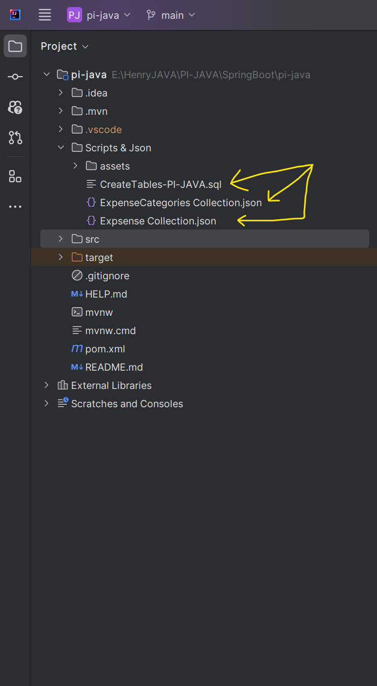
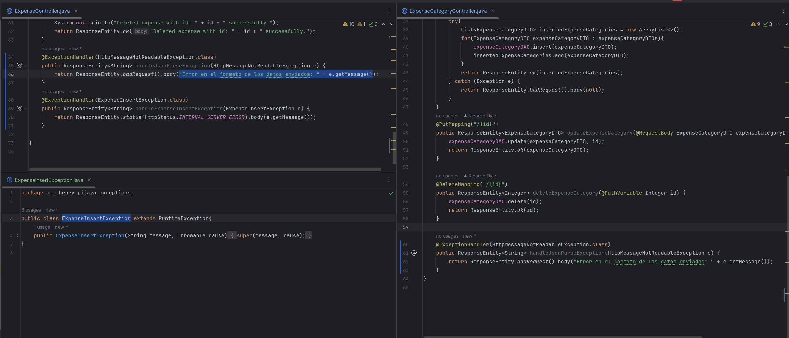
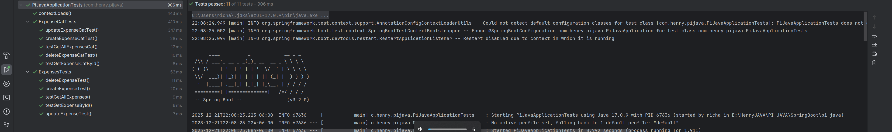

# PROYECTO INTEGRADOR - UPSKILLING JAVA

# Guía de Uso - Base de Datos de Gastos

Para poder interactuar con la base de datos, es necesario crear una DB de nombre `expenseDB` con la siguiente URL: `"jdbc:h2:tcp://localhost/~/expensDB"`. Una vez creada esta base de datos, podemos crear las tablas utilizando los scripts SQL en el archivo `CreateTables-PI-JAVA.sql`.

- Para insertar datos en las tablas, basta con importar las colecciones en Insomnia y enviar una solicitud POST.

Las ubicaciones de los scripts y las colecciones son las siguientes:

<!---->

## Colecciones de Insomnia

Las colecciones de Insomnia se muestran a continuación:

1. [Agregar Gasto](Scripts&Json/assets/addExpenses.png)
2. [Agregar Categorías de Gastos](Scripts&Json/assets/addExpensesCategories.png)

## Excepciones

Las excepciones en este proyecto se encuentran en los siguientes archivos:

## Pruebas

Se incluyen pruebas indicadas en la siguiente imagen, las cuales se pueden ejecutar desde la clase principal de las pruebas `PiJavaApplicationTests`:

¡Muchas gracias! 🙌

---
Creado por Ricardo Díaz 😎 - Diciembre 2023